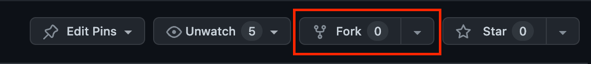

# Fun Exercise: Git Collaboration and Feature Toggle Challenge

## Table of Contents
- [Challenge 1: Three-Way Merge Practice by using git commit and git merge](#challenge-1-three-way-merge-practice-by-using-git-commit-and-git-merge)

- [Challenge 2: Three-Way Merge Practice by using Pull Request](#challenge-2-three-way-merge-practice-by-using-pull-request)

- [Challenge 3: Feature Toggle](#challenge-3-feature-toggle)

- [Challenge 4: Tag version](#challenge-4-tag-version)

- [Challenge 5: Undo Changes](#challenge-5-undo-changes-)

- [Challenge 6: Cleanup Branch](#challenge-6-cleanup-branch-)

# Prerequisites

- [Git](https://git-scm.com/downloads)
- [Go](https://go.dev/doc/install)
  - Mac: `brew install go` [Homebrew](https://brew.sh/) or visit [Go](https://go.dev/doc/install)
  - Windows: `choco install go` [Chocolatey](https://chocolatey.org/install)
  - Linux: `sudo apt-get install golang-go`

# Instructions

## Step 1: Fork the repository

- Click on the `Fork` button on the top right corner of this page [fork the repository to your own GitHub account](https://docs.github.com/en/pull-requests/collaborating-with-pull-requests/working-with-forks/fork-a-repo#forking-a-repository)



## Step 2: Clone the forked repository to your local machine

- Clone the forked repository to your local machine

```bash
git clone <your-forked-repository-url>
```

## Challenges

## Challenge 1: Three-Way Merge Practice by using git commit and git merge

### Guide:

- Create a new branch from the `main` branch e.g. `maithai-feature`
- Checkout to the new branch
- Edit the `CONTRIBUTORS.md` file by adding your name to the `Contributors` section
- `git status` to see status of the changes
- `git diff` to see the changes
- Add the changes to the staging area
- `git diff --staged` to see the changes in the staging area
- Commit the changes
- Checkout to the `main` branch
- Merge the new branch to the `main` branch
- Push the changes to the remote repository at main branch verify by using `git log --graph --oneline`. You should see the commit history like below:

```bash
* commit C (main): Merge branch 'maithai-feature'
|\
| * commit B (maithai-feature): Implement feature Maithai
|/
* commit A: Initial project setup
```

<details>

<summary>Hint Challenge 1 (try it your self first before open this hint)
</summary>

- Create a new branch from the `main` branch e.g. `maithai-feature`

```bash
git branch maithai-feature
```

- Checkout to the new branch

```bash
git checkout maithai-feature
```

- Edit the `CONTRIBUTORS.md` file by adding your name to the `Contributors` section
- Commit the changes

```bash
git add CONTRIBUTORS.md
git commit -m "Add my name to the Contributors section"
```

- Checkout to the `main` branch

```bash
git checkout main
```

- Merge the new branch to the `main` branch

```bash
git merge maithai-feature --no-ff
```

- Push the changes to the remote repository at main branch

```bash
git push origin main
```

</details>

## Challenge 2: Three-Way Merge Practice by using Pull Request

### Guide:

- Create a new branch from the `main` branch e.g. `monkan-feature`
- Checkout to the new branch
- Edit the `CONTRIBUTORS.md` file by adding your name to the `Contributors` section
- `git status` to see status of the changes
- `git diff` to see the changes
- Add the changes to the staging area
- `git diff --staged` to see the changes in the staging area
- Commit the changes
- Push the changes to the remote repository at the new branch
- Create a Pull Request from the new branch to your `main` branch (⚠️ <b>Create PR for your repository</b>)
- Merge the Pull Request
- Pull the changes from the remote repository at the `main` branch
- Verify by using `git log --graph --oneline`. You should see the commit history like below:

```bash
* commit E (HEAD -> main, origin/main): Merge pull request #1 from <your-github-username>/monkan-feature
|\
| * commit C (monkan-feature): Implement feature Monkan
|/
* commit C (main): Merge branch 'maithai-feature'
|\
| * commit B (maithai-feature): Implement feature Maithai
|/
* commit A: Initial project setup
```

<details>
<summary>Hint Challenge 2 (try it your self first before open this hint)</summary>

- Create a new branch from the `main` branch e.g. `monkan-feature`

```bash
git branch monkan-feature
```

- Checkout to the new branch

```bash
git checkout monkan-feature
```

- Edit the `CONTRIBUTORS.md` file by adding your name to the `Contributors` section
- Commit the changes

```bash
git add CONTRIBUTORS.md
git commit -m "Add my name to the Contributors section"
```

- Push the changes to the remote repository at the new branch

```bash
git push origin monkan-feature
```

- Create a Pull Request from the new branch to the `main` branch
- Merge the Pull Request
- Pull the changes from the remote repository at the `main` branch

```bash
git pull origin main
```

</details>

## Challenge 3: Feature Toggle
Don't worry if you are not familiar with Go. You can still complete this challenge by following the guide below.

### Guide:

- Checkout to the `main` branch
- Go to challenge3 directory `cd challenge-3-feature-toggle` directory
- `go run main.go` or `make go-run` and verify the result. You should see Sending via SMS.
- ⚠️ Unable to run the code?
  - Install Go by following the [Prerequisites](#prerequisites) section
  - `go version` to verify that Go is installed

```bash
Email notification feature toggle is DISABLED
Sending SMS to 0812345678: Hello, Go!
```

- Enable the Email feature by changing `isEmailEnabled` inside the `main` function to be `true`
- Verify the result make sure the email notification is sent to the email address that you specified by using `make go-run` then see the result.
- Commit the changes on the `main` branch
- Push the changes to the remote repository at the `main` branch
verify by using `make go-run`. You should see the email notification is sent to the email address that you specified

```bash
Email notification feature toggle is ENABLED
Sending email to kbtg@kampus.tech: Hello, Go!
```

<details>
<summary>Hint Challenge 3 (try it your self first before open this hint)</summary>

- Checkout to the `main` branch

```bash
git checkout main
```

- Go to challenge3 directory `cd challenge-3-feature-toggle` directory
- Enable the feature by changing the `isEmailEnabled` inside the `main` function to be `true`
- Verify the result make sure the email notification is sent to the email address that you specified

```bash
make go-run
```

- Commit the changes on the `main` branch

```bash
git add main.go
git commit -m "Enable email notification feature toggle"
```

- Push the changes to the remote repository at the `main` branch

```bash
git push origin main
```

</details>

## Challenge 4: Tag version

### Guide:

- Checkout to the `main` branch
- Create a new tag e.g. `v1.0.0`
- Push the tag to the remote repository
- Verify by using `git tag`. You should see the tag that you created or look at the GitHub repository tag section

```bash
v1.0.0
```

<details>
<summary>Hint Challenge 4 (try it your self first before open this hint)</summary>

- Checkout to the `main` branch

```bash
git checkout main
```

- Create a new tag e.g. `v1.0.0`

```bash
git tag -a v1.0.0 -m "Release version 1.0.0 : send email notification"
```

- Push the tag to the remote repository

```bash
git push origin --tags
```

</details>

## Challenge 5: Undo Changes ⏰

### Guide:

- Checkout to the `main` branch
- Show the commit history
- Pick the commit hash that you want to revert
- Revert the commit (Preserve the history)

<details>
<summary>Hint Challenge 5 (try it your self first before open this hint)</summary>

```bash
git revert <commit-hash>
```

</details>

## Challenge 6: Cleanup Branch 🧹

### Guide:

- Delete `maithai-feature` and `monkan-feature` branch
- Push the changes to the remote repository

<details>
<summary>Hint Challenge 6 (try it your self first before open this hint)</summary>

```bash
git branch -d maithai-feature
git push origin --delete maithai-feature

git branch -d monkan-feature
git push origin --delete monkan-feature
```
</details>
